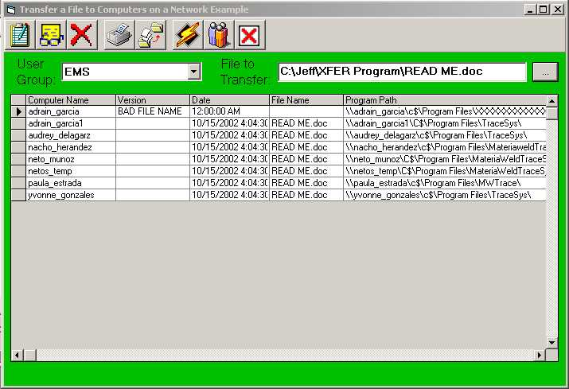



## Transfer files to select computers over a network

### Description

As a computer programmer, you may be developing one or more projects to run on certain computers on a network environment. Once the initial installation takes place for each computer, you may have a need to change the code for a program, recompile, and create a new EXE file,and copy the EXE file to each computer needing this program update on your network. NOTE: To use this demo, you must have System Admin rights or try typing in a UNC path and access their computer remotely. (Example Shown Right) The file must be closed before you can copy it to networked computers.

You could, of course, Use Start / Run / and type in the UNC path and dump the file to each computer (like illustrated above) - then copy the file over. There may even be other methods to do this, but the method I developed allows you to send the EXE file (or other file(s) if necessary), to each computer on the network (only those running your software) through its computer identification name.

This program was written about 1 ½ years ago – found partial code that was missing – so I’m uploading this for you’ll. Did some simple modifications to it before uploading it to PSC. Forms are quite simple and it uses DAO (I know it’s old) but still works very well. See for yourself – then change to ADO if you wish.

This YourApp.vbp and TransferApp.vbp does not require any outside OCX or DLL. You do have to reference the Microsoft Scripting Runtime.

Please read the README.doc Word Document for proper preparation, setup, and execution of this demo. If you don't have MS WORD, you can download the WORD viewer from Microsoft's web site. If you like this program, please feel free to vote - please leave suggestions and/or comments. Thanks
 
### More Info
 
As a computer programmer, you may be developing one or more projects to run on certain computers on a network environment. Once the initial installation takes place for each computer, you may have a need to change the code for a program, recompile, and create a new EXE file,and copy the EXE file to each computer needing this program update on your network. NOTE: To use this demo, you must have System Admin rights or try typing in a UNC path and access their computer remotely. (Example Shown Right) The file must be closed before you can copy it to networked computers.

You could, of course, Use Start / Run / and type in the UNC path and dump the file to each computer (like illustrated above) - then copy the file over. There may even be other methods to do this, but the method I developed allows you to send the EXE file (or other file(s) if necessary), to each computer on the network (only those running your software) through its computer identification name.

This program was written about 1 ½ years ago – found partial code that was missing – so I’m uploading this for you’ll. Did some simple modifications to it before uploading it to PSC. Forms are quite simple and it uses DAO (I know it’s old) but still works very well. See for yourself – then change to ADO if you wish.

This YourApp.vbp and TransferApp.vbp does not require any outside OCX or DLL. You do have to reference the Microsoft Scripting Runtime.

Please read the README.doc Word Document for proper preparation, setup, and execution of this demo. If you don't have MS WORD, you can download the WORD viewer from Microsoft's web site.

             |
---                |---
**Submitted On**   |2002-10-16 08:25:34
**By**             |[Jeff D](https://github.com/Planet-Source-Code/PSCIndex/blob/master/ByAuthor/jeff-d.md)
**Level**          |Beginner
**User Rating**    |4.5 (36 globes from 8 users)
**Compatibility**  |VB 4\.0 \(32\-bit\), VB 5\.0, VB 6\.0
**Category**       |[Files/ File Controls/ Input/ Output](https://github.com/Planet-Source-Code/PSCIndex/blob/master/ByCategory/files-file-controls-input-output__1-3.md)
**World**          |[Visual Basic](https://github.com/Planet-Source-Code/PSCIndex/blob/master/ByWorld/visual-basic.md)
**Archive File**   |[Transfer\_f14693510162002\.zip](https://github.com/Planet-Source-Code/jeff-d-transfer-files-to-select-computers-over-a-network__1-39878/archive/master.zip)

